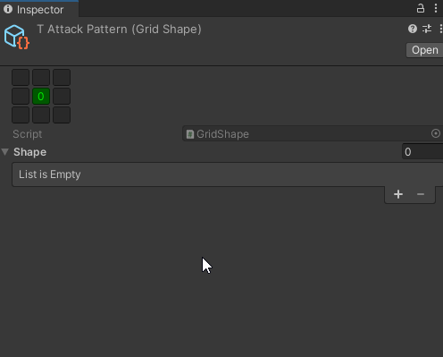

# Tilemap Pathfinding
Extending Unity's Tilemap system to support pathfinding, and other tools used in grid based games. 

The goal is to allow the user to seamlessly draw/paint maps with Unity's built-in tilemap system, and have it _just work_ with pathfinding. 

Currently focused on 2D grids, although I plan to add support for 2D-with-elation change and 2D-in-3D space (2.5D)

## Features
### Pathfinding
- A*, Dijkstra's, and bread-first pathfinding algorithms.
- Pathfinding can be extended and used with other systems (Just implement IGraph and INode interfaces)
- Different costs per tile/node, update walkability at runtime.
- Supports all types of tilemap layouts (rectangular grid, isometic grid, hexagonal grid)

### Shapes

- Custom editor script for editing shapes on a grid
- Combine multiple shapes together, or subtract for more complex patterns.

## Pros and Cons
- Pro: No object-initialization per tile. Many solutions read the tilemap and spawn some kind of 'node' object for each one. The advantage is easily doing hover effects, but the disadvantage is that our map basically exists twice.
- Pro: Just use the tilemap system like normal. Lots of existing solutions are just prefab painting on a grid, with lots of editor convenience tools. That's fine, but I want to use Unity's tools that we already know.
- Pro: Pathfinding can be extended for use on whatever. No need to have multiple astar algorithms implemented in your project just because you use multiple systems. 
- Pro/Con: Hex Tiles convert to cube coordinates for internal use. Con: We have to remember that when accessing grid cooridnates. Pro: Lots access to useful hex utility functions.
- Con: NavTiles. One has to use the NavTile type that extends from tile, which stores information like weight. It's _absolutely_ possible not to have to use this, from a systems point of view, but I don't plan on supporting "default tiles are assumed walkable with cost of 1". If we are going to do it, we should do it right.
- Con: If you are using ScriptableTiles, which NavTile basically is, like the Road example un unity's manual, that will need to adjust it to extend from NavTile instead of Tile. Everything else should still work, NavTile just adds fields, it doesn't override RefreshTile or so on.
 
## Planned/Not Supported (Yet)
- iso grids not yet tested.
- Obstacles & Agents. NavTiles that know that objects are on top of them, blocking the way or adding cost for pathfinding.
- Encapsulate pathfinding in coroutine for single-thread non-blocking (er... less blocking?) searches.
- Example movement and usage scripts
- Off-grid links between separate tilemaps.

Playground for testing adding pathfinding to unity tilemaps. This is a 2DURP project, and when done, I will probably move it to a proper "package" project.

